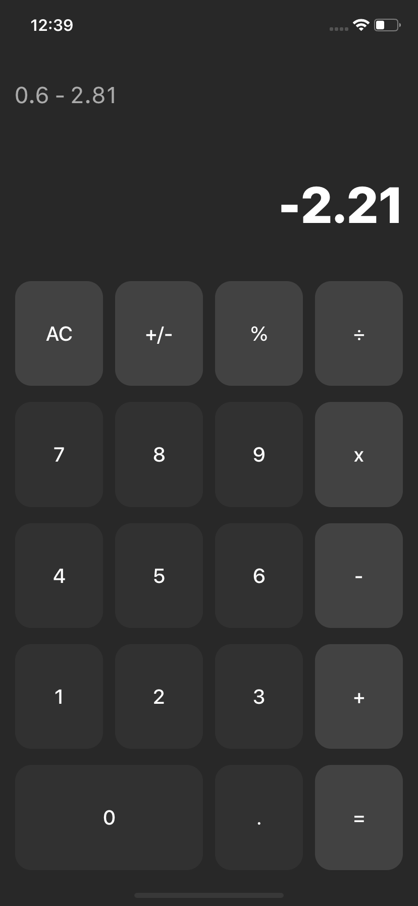
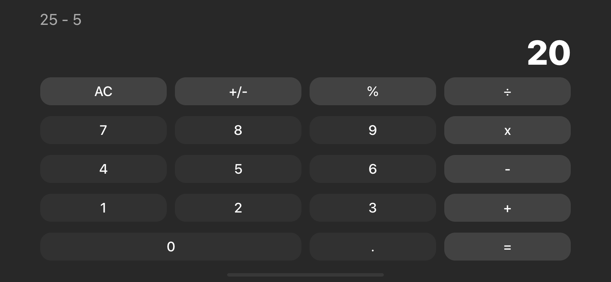

# Basic Calculator

Yet another iOS calculator.

## About the Project

The main purpose of the project was to create a calculator that support the following operations:
- Addition
- Subtraction
- Multiplication
- Division 
- Mod

Since it's my first iOS app, there are many things to fix, so I will come back in three months (lol, some time in 2020) to refactor and hopefully I can see significant change in my programming skills.

## Screenshots
### Portrait Mode

### Landscape Mode

